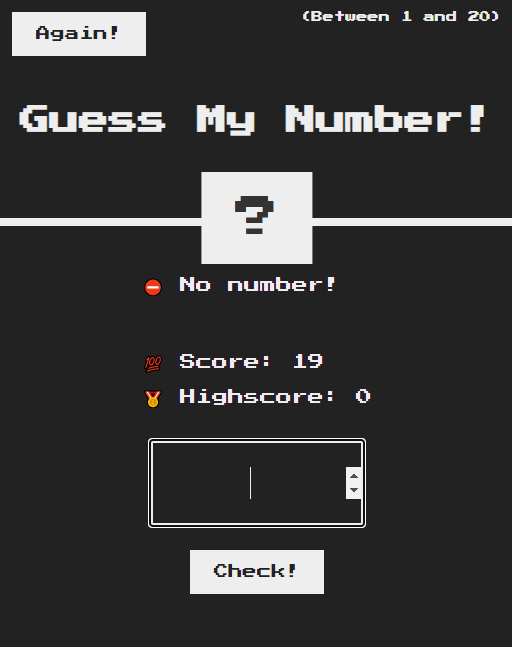
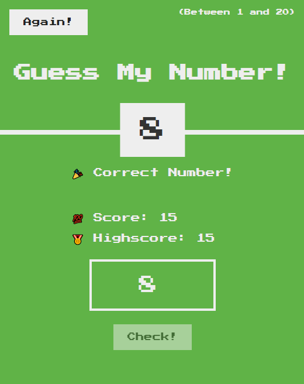

# Guess my number game

Fun game with 3 levels where the player has to guess a number generated by the computer

## Table of contents

- [Overview](#overview)
  - [Game features](#game-features)
  - [Screenshots](#screenshots)
  - [Links](#links)
- [Built with](#built-with)
- [Author](#author)

## Overview

### Game features

- Player is be able to choose between 3 different levels

- Player can play again and highscore will be saved

- Input validation 

- Sound effects

- View the optimal layout for the interface depending on their device's screen size

- See hover and focus states for all interactive elements on the page

### Screenshots

#### Three different levels

#### Input validation

#### When the player guesses the correct number

#### Player can play again and highscore will be saved

### Links
- Live Site URL: [Guess my number game](https://kiyomidev.github.io/guess-my-number-game/)

## Built with

- Semantic HTML5 markup
- CSS custom properties
- Flexbox
- Vanilla javaScript

## Author
- Facebook - [@KiyomiDev0](https://www.facebook.com/KiyomiDev0)